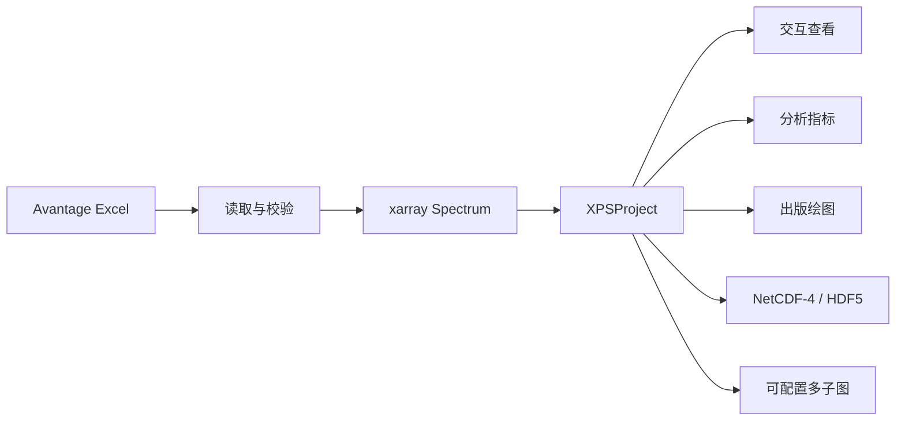

# OpenXPSAnalyzer 软件设计哲学手册

> 产品与技术设计原则 · Version 1.0
> 适用于 OpenXPSAnalyzer 0.4.x 及后续兼容版本
> Copyright © 2026 Jay Mamun and OpenXPSAnalyzer contributors · AGPL-3.0-or-later

## 1. 手册目的

这份手册说明 OpenXPSAnalyzer 为什么以当前方式工作，以及后续功能应当如何被设计、评审和实现。它不是逐个按钮的使用教程，也不是某个框架的编程指南，而是项目在产品体验、科学数据、软件架构和长期维护方面的共同判断标准。

当新需求、技术便利或视觉偏好彼此冲突时，应优先遵守本手册中的核心原则。若确实需要偏离，应记录原因、影响范围、迁移方案和验证证据。

## 2. 产品使命

OpenXPSAnalyzer 的使命是把 Avantage 导出的 XPS 数据转化为一个可信、清晰、可追溯、可复用的分析项目，同时让研究者把注意力放在谱图和科学判断上，而不是文件格式、绘图库或界面操作上。

软件服务于以下完整过程：



这条链路中的每一步都应可解释、可测试，并且尽可能保留前一步的信息。

## 3. 八项核心原则

### 3.1 科学数据优先于界面状态

界面只是数据的视图，不能成为数据的唯一来源。谱图、分峰名称、样品信息和分析所需元数据必须落在领域模型或持久化项目中，而不是只保存在某个控件里。

任何会改变科学含义的操作，都应先更新 `Spectrum` 或 `XPSProject`，再刷新界面。关闭窗口、切换谱图或保存项目不应改变同一数据的含义。

### 3.2 忠实保存，显式解释

软件不应悄悄“修好”具有科学含义的数据。读取阶段可以完成列名标准化、数值转换、无效行过滤和结构校验，但不能未经用户知情地平滑、归一化、移动峰位或重做拟合。

若未来增加校正、背景扣除、归一化或峰拟合功能，必须保存参数、方法、时间和来源，并能够区分原始输入与派生结果。

### 3.3 一个项目只有一个事实来源

内存中的 `XPSProject` 是当前会话的事实来源；每条 `Spectrum.data` 是对应谱图数值与元数据的事实来源。Pandas DataFrame 用于输入输出和绘图适配，不承担长期状态管理。

同一信息不应在多个模块中以互不关联的副本长期存在。重复数据若不可避免，必须说明谁是主数据、何时同步。

### 3.4 渐进式呈现复杂度

默认界面应优先展示当前谱图。项目列表和分析结果放入左右抽屉，需要时展开；详细表格位于谱图下方；高级导出和分峰命名位于工具区。

复杂功能可以存在，但不应同时争夺用户注意力。研究者应当先看见数据，再选择分析或导出动作。

### 3.5 交互查看与出版输出各司其职

交互图用于探索：强调悬浮数值、快速切换、图例和响应速度。静态图用于沟通：强调稳定布局、字体、线型、分辨率和导出格式。

两者必须来自同一个 `Spectrum` 和相同的分峰模式，但不必被迫使用同一种绘图技术。当前实现使用 Flet 原生图表完成应用内交互，使用 Matplotlib 生成出版级图，并使用 Plotly 导出自包含 HTML。

### 3.6 可逆、可追溯、少破坏

导入 Excel 不修改原文件；从项目中移除谱图不删除源文件；多子图只读取当前工作区中的谱图；保存项目采用临时文件后原子替换。

不可逆操作必须明确目标、给出确认，并尽量提供可恢复路径。未来若增加数据编辑，应优先采用操作历史或派生数据集，而不是覆盖原始数组。

### 3.7 跨平台一致，平台能力坦诚

Web、macOS 和 Windows 应共享同一领域模型、分析逻辑和主要交互语言。平台差异只应出现在文件选择、下载和系统集成层。

浏览器不能直接遍历本地目录，因此 Web 端使用多文件选择和浏览器下载；桌面端可以使用文件夹导入和直接保存到本地路径。界面必须坦诚呈现这种差异，不能用无法完成的按钮制造虚假一致性。

### 3.8 错误必须可理解

用户应看到“哪个文件、哪一列、哪一步、为什么失败”，而不是底层库的长堆栈。领域模块抛出 `XPSError` 体系中的可读异常；UI 在边界处捕获错误并通知用户。

错误不应被静默吞掉。批量导入可以汇总失败项，但必须说明成功数量和失败原因。

## 4. 用户心智模型

软件使用四层概念，界面文案和代码命名应保持一致：

| 层级 | 用户理解 | 软件对象 | 典型标识 |
| --- | --- | --- | --- |
| 源文件 | Avantage 导出的一个 Excel 文件 | 文件路径或上传内容 | `C1s.xlsx` |
| 谱图 | 一个 Survey 或高分辨区域 | `Spectrum` | `C1s` |
| 项目 | 一个样品或一次整理后的谱图集合 | `XPSProject` | `Samples` |
| 项目文件 | 可恢复整个项目的持久化文件 | xarray `DataTree` / NetCDF | `Samples.nc` |

文件夹导入时，文件夹名通常成为样品或项目名，文件名去除后缀后的 stem 成为谱图名和 xarray 节点名。这一规则简单、可预测，并与实验室已有文件管理习惯一致。

## 5. 架构哲学

### 5.1 分层而不是堆叠

项目按责任分为以下层次：

| 层次 | 当前模块 | 责任 | 不应承担 |
| --- | --- | --- | --- |
| 入口层 | `src/main.py` | 启动 Flet 应用 | 业务逻辑 |
| UI 编排层 | `app.py` | 页面状态、事件、对话框、平台文件流程 | 数值算法、格式规则的重复实现 |
| 交互绘图层 | `ui_charts.py` | Flet 原生交互谱图 | 项目持久化 |
| 领域模型层 | `models.py` | `Spectrum`、`XPSProject` 与不变量 | 控件状态 |
| 输入层 | `readers.py`、`importers.py` | Avantage 读取、类型识别、文件夹规则 | 绘图样式 |
| 分析层 | `analysis.py` | 指标和分峰统计 | UI 通知 |
| 绘图层 | `plotting.py`、`multipanel.py` | Matplotlib、Plotly、交互 HTML 与可配置多子图渲染 | 文件选择 |
| 存储层 | `storage.py` | DataTree、NetCDF、兼容读取、原子保存 | 页面布局 |

依赖方向应由 UI 指向领域与服务层，而不是领域模型反向依赖 Flet。这样读取、分析、绘图和存储接口才能在 Notebook、测试或批处理脚本中复用。

### 5.2 UI 编排层的演进边界

`app.py` 可以集中描述一个中小型应用，但不应无限增长。出现下列任一情况时，应优先拆分控制器或服务，而不是继续添加事件方法：

- 同类文件操作出现三套以上平台分支；
- 一组状态需要被多个页面共同修改；
- 某个事件流程无法在不创建完整页面的情况下测试；
- 导入、导出或批处理逻辑开始包含科学计算；
- 单个功能的修改需要频繁触碰互不相关的 UI 区域。

建议未来按 `project_controller`、`import_controller`、`export_service` 和 `view_state` 拆分，同时保持现有领域接口不变。

## 6. 数据模型哲学

### 6.1 `Spectrum` 是最小科学单元

每条谱图使用独立的 `xarray.Dataset`。这允许不同区域拥有不同点数和不同分峰数量，不需要为整齐的二维表而补零或填充无意义数据。

核心坐标与变量为：

- `point`：稳定的数据点索引；
- `binding_energy`：结合能坐标，单位 eV；
- `intensity`：原始强度；
- `fitting_curve`：拟合包络，仅拟合谱存在；
- `background`：背景，仅拟合谱存在；
- `component_intensity`：以 `component × point` 存储的分峰数据。

谱图类型只有两种合法状态：

- `raw`：必须具有结合能和原始强度；
- `fit`：除上述内容外，必须同时具有拟合包络和背景。

拟合包络与背景只出现一个时属于不完整状态，应拒绝导入，而不是猜测用户意图。

### 6.2 元数据是数据的一部分

样品名、区域名、源文件、创建时间、单位、谱图类型、唯一 ID 和 schema 版本必须随谱图保存。它们不是装饰文字，而是保证追溯、命名和兼容性的组成部分。

唯一 ID 用于内部身份；可读名称用于展示和路径。重命名不应改变唯一 ID。

### 6.3 `DataTree` 表达真实层级

项目持久化采用以下路径：

```text
/{sample}/{file_stem}
```

每个叶节点保存一条独立谱图。项目根节点保存项目名、schema、保存时间和存储布局。当前 schema 为 `xps-analyzer-project / 1.0`。

这种结构比强行拼接成一个大矩阵更接近实验语义。`project_to_dataset()` 提供扁平统计视图，但不作为默认持久化结构。

### 6.4 NetCDF-4，而不是不存在的 NetCDF5

项目使用 xarray、`h5netcdf` 和 HDF5 写入 NetCDF-4。界面、文档和导出说明应始终使用准确名称，不制造“NetCDF5”格式概念。

## 7. 数据生命周期

### 7.1 读取

Avantage Excel 默认跳过前 15 行。Survey 读取前两列；Element 将前 3 列解释为结合能、原始强度和拟合包络，最后一列解释为背景，中间列按原顺序解释为分峰。

读取器负责：

- 文件存在性和扩展名检查；
- 列数量检查；
- 数值转换和必要列空值过滤；
- 自动识别 Survey 与 Element；
- 保持分峰从左到右的顺序。

读取器不负责：

- 自动改变峰的化学归属；
- 修正 Avantage 拟合结果；
- 根据经验删除“看起来异常”的数据点。

### 7.2 管理

导入后立即转为 `Spectrum`，随后由 `XPSProject` 管理。重复名称通过可读后缀消歧，重复唯一 ID 则视为错误。

项目状态使用 `dirty` 表示存在未保存更改。任何改变项目内容或科学元数据的动作都应正确更新该状态。

### 7.3 保存与恢复

保存过程先写入同目录临时文件，成功后替换目标文件，降低中途失败导致项目损坏的风险。读取时先检查 schema 和存储布局，并保留对旧扁平布局的兼容入口。

改变 schema 时必须升级版本，并提供迁移或明确拒绝信息。不得在相同 schema 版本下悄悄改变变量含义。

## 8. 分析哲学

分析指标应是可复算的确定性结果。同一数据、同一模式和同一版本应产生相同结果。

当前指标包括：

- 数据点数、能量范围和强度范围；
- 原始谱最大峰位；
- 拟合谱 RMSE、MAE 和 R²；
- 每个分峰的峰位、峰高和积分面积。

分峰数据支持两种明确模式：

- `absolute`：分峰列已经包含背景；
- `relative`：分峰列是扣除背景后的相对强度，显示时加回背景。

模式切换会影响分峰显示、峰高和面积的解释，因此必须在 UI、分析和绘图之间使用同一选择。任何新增指标都应说明数学定义、单位、有限值处理和边界条件。

## 9. 绘图哲学

### 9.1 尊重 XPS 领域习惯

结合能横轴默认从高到低。交互图内部可以使用坐标映射实现稳定渲染，但展示给用户的必须是真实结合能数值。

原始数据、拟合包络、背景和分峰需要通过线型、颜色、填充与图例形成清晰层级。颜色不能是唯一的信息通道，关键曲线还应使用线宽或虚线区分。

### 9.2 悬浮是读取工具，不是装饰

悬浮提示只提供完成判断所需的信息：曲线名称、结合能和强度。多分峰同时命中时应保持紧凑，避免遮挡主要数据。

交互图需要快速、清晰和响应式，不承担最终出版质量。其数值必须与静态图一致。

### 9.3 出版图追求稳定

静态图应具备稳定尺寸、完整轴标签、可配置图例和高 DPI 导出。应用预览可以隐藏 y 轴数值以减少视觉噪声，正式导出应保留完整坐标信息。

字体回退顺序应覆盖主要平台：PingFang SC、Hiragino Sans GB、Microsoft YaHei、Noto Sans CJK SC、Arial Unicode MS 和 DejaVu Sans。不得依赖用户不一定拥有的单一字体。

### 9.4 色卡服务于区分，不服务于炫技

色卡选择应保证相邻分峰可区分、打印和屏幕均可读，并尽量考虑色觉差异。新增色卡需要在浅色背景、多峰谱图和图例中检查，而不能只看色板本身。

## 10. UI 与交互哲学

### 10.1 主谱图是视觉中心

项目数据和分析结果使用可收纳抽屉，主页面不永久占用左右侧栏。工具区允许换行，保证 900 像素宽窗口仍然可用。

界面应保持平静、专业、信息密度适中。现代感来自一致的间距、层级、圆角、颜色和反馈，而不是无目的动画或装饰。

### 10.2 每个状态都需要出口

空项目应告诉用户如何开始；未选择谱图时不显示伪造结果；导入失败应允许重新选择；长表格应提供分页；抽屉和对话框都应有清晰关闭方式。

### 10.3 文本必须完整可理解

关键名称使用 tooltip、最多行数和省略策略，避免控件挤压造成逐字换行。按钮优先使用短动词或名词，详细解释放入 tooltip、帮助文字或软件说明。

中文、英文、数字、单位和特殊化学符号应在 macOS、Windows 和 Web 中保持可读。设计时不能假定所有用户都使用相同字体或系统缩放比例。

### 10.4 大数据预览不能阻塞主任务

前 30 行和后 30 行用于快速检查文件结构；“全部数据”通过每页 50 行遍历完整数据，避免一次创建数千个表格控件。分页是一种性能和可读性策略，不代表丢弃数据。

## 11. 跨平台哲学

### 11.1 共享核心，隔离边界

读取、模型、分析、绘图和存储逻辑必须平台无关。只有文件选择、目录访问和浏览器下载位于平台边界。

| 能力 | Web | macOS / Windows 桌面端 |
| --- | --- | --- |
| 单文件导入 | 上传内容 | 读取本地路径 |
| 文件夹导入 | 浏览器限制，不直接支持 | 支持 |
| 多文件导入 | 支持 | 支持 |
| 保存项目 | 浏览器下载 | 直接写入路径 |
| 多子图绘图 | 下载所选格式的组合图 | 直接保存所选格式的组合图 |
| 字体 | 浏览器系统字体 | 系统字体 + Matplotlib 回退 |

### 11.2 平台适配不是最低公分母

桌面端可以利用文件系统优势，Web 端可以利用零安装和下载体验。两端不必拥有完全相同的操作形式，但必须产生语义等价的项目和输出。

## 12. 导出与多子图哲学

导出是科学工作流的一部分，不是截图功能。输出应具备明确名称、稳定布局和可追溯内容。

多子图绘图必须先打开独立设置子窗口，由用户明确完成以下选择：

- 从当前工作区勾选参与绘制的谱图；
- 调整谱图顺序；
- 设置行数、列数，并在容量不足时阻止渲染；
- 生成 `(a)`、`(b)` 等连续标签，或逐项编辑为自定义文本；
- 设置标签位置、色卡、分峰模式、标题、图例、尺寸、DPI 和导出格式；
- 在最终导出前生成预览。

组合图只读取当前项目状态，不修改谱图或源 Excel。Web 端下载一张所选格式的组合图；桌面端保存到用户选择的文件。文件名需要经过安全清理，但应尽量保留可识别的项目名称。

自包含 Plotly HTML 应能够离线打开，避免把研究结果绑定到临时服务器或第三方托管。

## 13. 错误处理与安全哲学

### 13.1 在最接近问题的位置校验

缺列、空数据和谱图结构问题由读取或模型层发现；schema 和文件损坏由存储层发现；路径选择取消由 UI 层处理。不要把所有问题推迟到绘图时才暴露。

### 13.2 宽异常只允许出现在边界

UI、第三方文件格式和批处理边界可以捕获广义异常，以保证应用不崩溃并向用户报告。领域算法内部应捕获更具体的异常，避免掩盖编程错误。

### 13.3 默认不覆盖、不删除

多子图导出由用户明确选择目标文件，删除谱图只影响当前项目，源 Excel 保持不变。任何未来的覆盖、清理或批量删除功能都必须提供明确目标与确认。

## 14. 开源治理与产品身份

OpenXPSAnalyzer 的产品名称、构建元数据、软件说明、README 和许可证必须保持一致：

```text
Copyright © 2026 Jay Mamun and OpenXPSAnalyzer contributors.
SPDX-License-Identifier: AGPL-3.0-or-later
```

项目采用 GNU Affero General Public License v3.0 or later。贡献者保留其贡献的著作权，并同意在同一许可证下提供贡献。修改版在分发时必须继续保持相同的开源自由；通过网络向用户提供修改版时，也必须提供对应源代码入口。任何贡献不得加入与 AGPL 冲突的额外限制。

项目欢迎个人与机构贡献，但合并标准以科学正确性、可维护性、可测试性和许可证兼容性为准。第三方依赖仍分别遵守其自身许可证；引入依赖、数据集、图标或示例文件前必须确认其许可证允许在本项目中使用和再分发。

本手册描述产品设计原则，具体权利与义务以项目根目录的 `LICENSE` 为准。

## 15. 质量与测试哲学

测试不是实现后的证明，而是数据契约的一部分。每次改变至少应选择与风险相称的验证：

### 15.1 必须自动验证的内容

- Survey 与 Element 列映射；
- 自动类型识别和错误输入；
- `Spectrum` 往返 DataFrame；
- DataTree 路径、schema 与 NetCDF 往返；
- 指标数学结果；
- XPS 反向结合能坐标；
- 静态、交互和多子图渲染的基本输出；
- Web 选择事件等已知平台差异。

### 15.2 必须使用真实数据验证的内容

- Avantage 实际表头与描述行；
- 文件命名规则；
- 不同区域的数据点数和分峰数量；
- 文件夹批量导入；
- NetCDF 项目路径；
- 多谱图自定义选择、顺序、布局、标签和空白子图处理。

`B1_sic` 是当前真实回归样本。合成测试保证边界准确，真实测试保证假设没有脱离实际文件。

### 15.3 必须目视验证的内容

- 900、1024 和常用宽屏布局；
- 中英文与特殊符号字体；
- 抽屉、对话框和空状态；
- 多分峰悬浮提示；
- 交互图与出版图的一致性；
- macOS、Windows 和 Web 的关键文件流程。

## 16. 版本与兼容哲学

应用版本和项目 schema 版本是两个不同概念：

- 应用版本描述软件功能，例如 `0.4.0`；
- schema 版本描述持久化数据契约，例如 `1.0`。

应用可以升级而 schema 不变。只有持久化结构或字段语义改变时才升级 schema。读取旧格式时优先提供明确迁移；无法安全迁移时，应拒绝并说明支持范围。

依赖通过 `uv.lock` 固定，开发和发布都应以锁文件为依据。当前支持 Python 3.11–3.12；扩大 Python 版本范围前，需要先验证 macOS 隐藏虚拟环境中的可编辑包导入、Flet 桌面启动和完整测试。升级 xarray、Flet、Matplotlib 或文件引擎时，也需要重新运行真实数据、存储和界面回归。

## 17. 当前非目标

为了保持边界清晰，当前版本不以以下能力为目标：

- 替代 Avantage 完成完整的峰拟合算法；
- 修改或写回原始 Avantage Excel；
- 作为实验室信息管理系统管理所有样品；
- 自动判断化学键归属而不给出人工确认；
- 通过云服务强制托管用户数据；
- 为视觉效果牺牲科学数值或导出可复现性。

这些方向未来可以评估，但必须先明确科学责任、数据来源、验证方法和用户控制权。

## 18. 新功能决策问题

任何重要新功能进入实现前，应回答：

1. 它解决的是哪一个真实研究任务？
2. 输入数据和输出结果分别是什么？
3. 是否改变科学含义，能否追溯和撤销？
4. 真正的事实来源放在哪里？
5. Web、macOS 和 Windows 的行为如何对应？
6. 大文件和多分峰情况下是否仍然可用？
7. 错误如何被用户理解？
8. 如何自动测试、真实数据测试和目视测试？
9. 是否影响 NetCDF schema 或已有项目？
10. 是否保持 OpenXPSAnalyzer 的产品身份、贡献历史和 AGPL 许可边界？

若这些问题没有清晰答案，功能还没有准备好进入核心产品。

## 19. 代码评审清单

提交变更前至少确认：

- [ ] 没有在 UI 层重复实现读取、分析或存储规则；
- [ ] 没有未经说明地改变原始数据；
- [ ] 新状态拥有明确唯一的数据来源；
- [ ] 用户可见错误具体且可操作；
- [ ] 文件操作不会意外覆盖或删除用户数据；
- [ ] 结合能方向、单位和分峰模式保持正确；
- [ ] Web 与桌面平台差异已处理；
- [ ] 中英文和长名称不会破坏布局；
- [ ] 自动测试、真实数据测试和静态检查通过；
- [ ] README、版本、schema 或软件说明在需要时同步更新；
- [ ] 贡献来源清楚，版权说明和 AGPL 许可证未被无意改变。

## 20. 一句话准则

> 让数据比界面更长寿，让科学含义比技术实现更稳定，让每一次操作都清楚、可信并可追溯。
